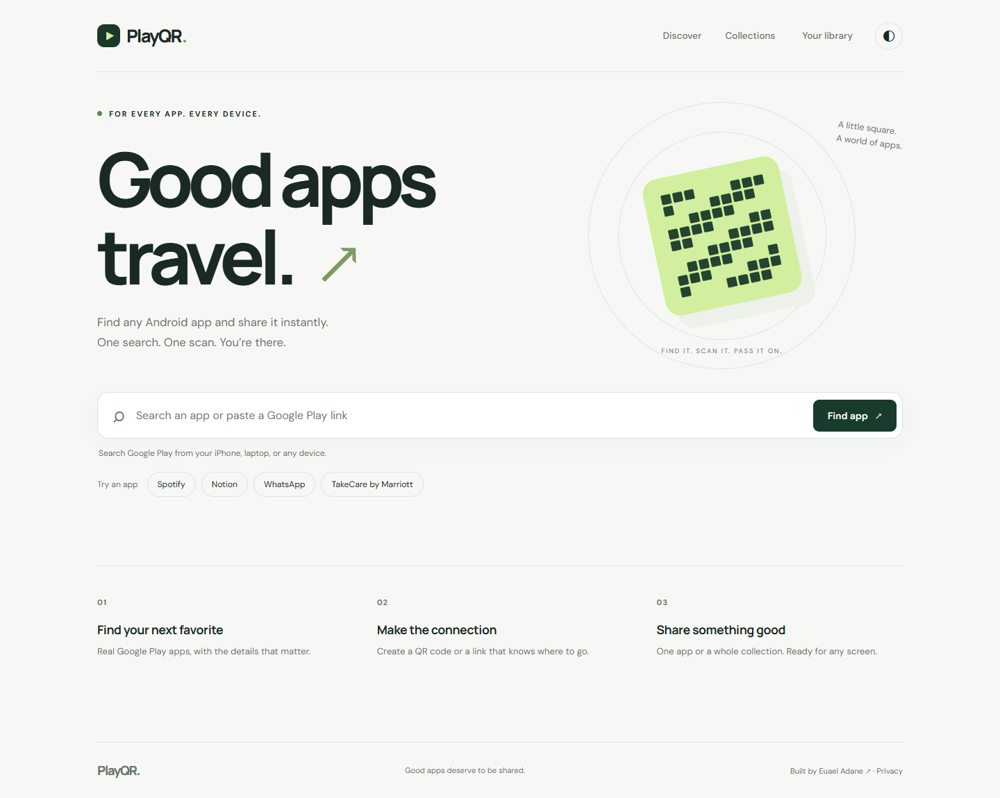

# PlayQR — Good apps travel.

Discover Android and iPhone apps from any device. Share an exact store listing, a device-aware QR, or a curated collection.

[Live demo](https://eyuad.github.io/playqr/) · [Architecture](docs/architecture.md)



## What it does

Search by app name or paste a Google Play / App Store listing. Choose the correct app using its original icon, developer, category, rating, and price when available. Export a QR locally, save a favorite, or publish a shareable collection.

### Core features

- Debounced, cached Google Play and Apple App Store search, store filters, original artwork, keyboard navigation, and explicit empty/error states.
- App-detail pages with direct store links and locally generated PNG/SVG QR downloads.
- High-contrast QR palettes, light backgrounds, three export sizes, and reset controls.
- Smart links: manually confirm matching versions to route Android to Google Play and iPhone to the App Store. Other devices or unavailable platforms see a share page.
- Collections: up to 20 apps across both stores, themed covers, categories, curator notes, public snapshots and editable copies of shared collections.
- A browser-owned library: favorites, recent apps/searches, shared links, most-visited links, and last-visited times.
- Real 7-day, 30-day, and all-time aggregate analytics; no fabricated metrics.
- Owner-only title editing, confirmed link revocation, and analytics CSV export.
- Optional Google/email accounts, revision-protected library sync and opt-in public collection profiles. These stay disabled until [authentication setup](docs/accounts-setup.md) is complete.
- Responsive light/dark themes, visible keyboard focus, reduced-motion support, and offline messaging.

## Architecture and stack

The vanilla-JavaScript frontend and Cloudflare Worker remain the foundation. Vite builds modular JavaScript/CSS, `qrcode` generates images on-device, and Cloudflare D1 stores links, aggregates, cloud libraries and profiles. Optional Supabase Auth handles identity; the Worker verifies sessions before accessing account data. Guest search and sharing do not require an account.

```text
Browser → Worker /search or /app → Google Play / Apple listings
Browser → local QR generation → PNG / SVG
Browser → Worker /links → D1 published snapshot
Scan → Worker /a/:code → Matching Google Play / App Store listing
                       → PlayQR share page (other devices / collections)
                       → D1 daily aggregate (eligible visits only)
```

```text
frontend/          HTML, styles, UI, library, QR and API modules
shared/            URL validation, redirects, collection and QR rules
worker/            API routes, Play metadata parser, deployment configuration
worker/migrations/ Additive D1 schema migrations
tests/             Unit/API tests, real local D1 integration, browser smoke test
docs/              Audit, architecture, screenshots, deployment notes
dist/              Generated production build
index.html assets/ Published GitHub Pages build snapshot
```

## Engineering decisions

**A selected app, never search results.** Every QR resolves to an exact Android package or namespaced Apple app ID. Only canonical HTTPS store destinations are accepted. App metadata is rendered as text, never injected as HTML. Cross-store pairing requires creator confirmation; PlayQR does not claim to verify developer relationships.

**Structured metadata first.** Google uses JSON-LD with limited Open Graph fallback; Apple uses its Search/Lookup API. Missing fields stay absent. Icons are restricted to the stores' known image hosts.

**Small, bounded requests.** Search requests up to six results per store, with timeouts, five-minute search caching, and six-hour app caching at the edge. Both-store search can show partial results when one provider fails. The browser cancels stale searches. QR generation and the authentication client are lazy-loaded.

**Reliable QR customization.** Three dark inks, two light backgrounds, a four-module quiet zone, and high error correction. No center logos or cosmetic module shapes that might compromise scanning. Tests decode every palette to the exact destination.

**Guest-first, account-ready.** A random browser key owns guest links; only its hash is stored. Optional accounts use server-verified Supabase sessions, separate local storage, and optimistic cloud revisions to prevent silent overwrites. Importing guest links requires an explicit action. Clearing guest data still loses guest management access.

## Smart links

`https://playqr-search.adaneeuael07.workers.dev/a/{code}` is a stable, randomly generated link. App links redirect to a matching store listing for the device when one is included. Otherwise they open the PlayQR share page. Collections always open their collection page. Device detection uses simple user-agent classification, not fingerprinting.

Collection publication creates a snapshot. Editing a draft does not silently change existing shared links. Direct store QR codes continue to work without a database or smart-link service.

## Analytics and privacy

Counts represent **link opens**, not unique people or provable camera scans. Repeated opens count again. Known bots, previews, prefetch requests, HEAD requests, Do Not Track, and Global Privacy Control are excluded where detectable.

The app stores daily totals by link, device category, browser family, and approximate country. Analytics does not store raw IPs, full user agents, referrers, precise locations, cookies, or visitor identifiers. Cloudflare uses IPs transiently for rate limiting. Icons come from Google and Apple; fonts come from Google; QR images are generated locally. Account sessions are separate from anonymous visitor analytics.

The dashboard is protected by the browser key or verified account session. Public responses do not expose private totals or cloud drafts. Aggregates persist for the lifetime of a link and are deleted on revocation. See [architecture and operational limitations](docs/architecture.md).

## Local development

Use Node.js 22.12+ and npm. Chrome is needed only for the optional browser smoke test.

```sh
npm ci
npx wrangler d1 migrations apply playqr-sharing --local --config worker/wrangler.local.jsonc
npm run worker:dev
```

In a second terminal, copy `.env.example` to `.env.local`, set `VITE_API_URL=http://127.0.0.1:8787`, and run:

```sh
npm run dev
```

Open `http://127.0.0.1:5173`. Local D1 data lives under `worker/.wrangler/`, not in production. Internet access is required for real Google Play searches. Do not commit `.env.local`, credentials, browser management keys, or local database files.

```sh
npm test                 # URL/redirect/metadata/QR/API validation tests
npm run lint
npm run build
npm run worker:build     # Worker bundle validation, no deployment
node tests/integration.mjs # local Worker and migrated D1 must be running
node tests/browser.mjs     # local frontend + Worker + Chrome; real upstream requests
```

The browser check covers real search/icons, QR sizing/export, smart links, collection publishing, mobile overflow, and dark mode. Integration checks verify owner isolation and privacy opt-outs against real local D1. Upstream Google Play timeouts can fail browser tests; they are not hidden behind synthetic production data.

## Deployment

See [deployment guide](docs/deployment.md) for database setup, verification, publishing to the existing GitHub Pages branch, and rollback. Deploy the Worker before the frontend. The production database ID in the configuration is an identifier, not a secret; use your own database/account when forking.

## Roadmap

- Complete production Google/email provider setup and expand account lifecycle controls.
- Configurable automatic aggregate retention (owner-controlled link revocation is available).
- Licensed/contracted app-metadata provider if usage outgrows public-page extraction.
- Automated accessibility audits, wider browser coverage, and service-level monitoring.
- Signed release previews and automated deployment once repository deployment permissions are configured.

PlayQR is independent of Google and Apple and is not affiliated with either store or the apps it lists.
